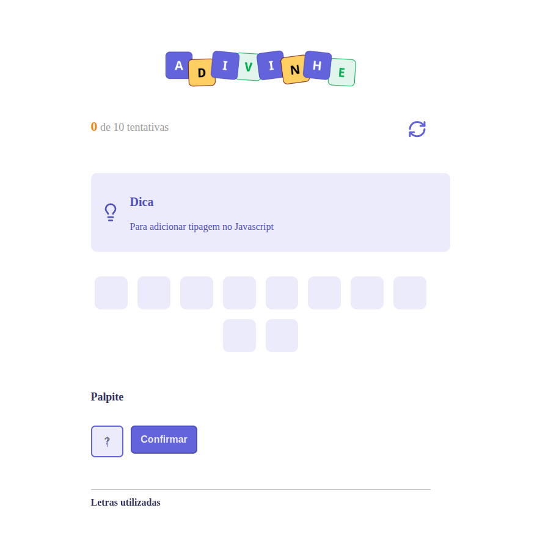
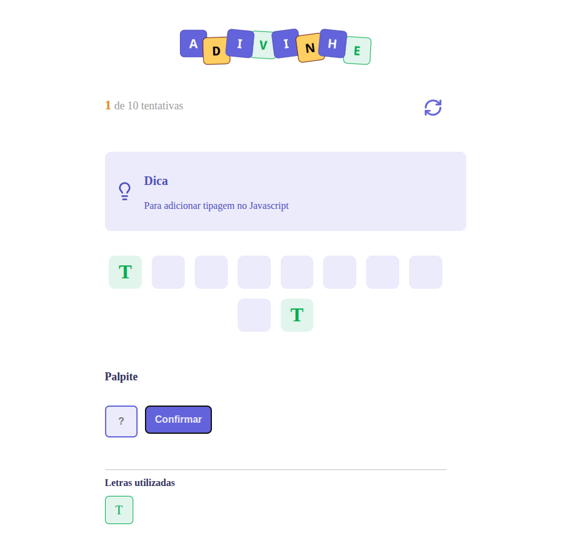

# 🚀 Adivinhe

Este projeto é um **jogo de adivinhação de palavras** desenvolvido durante a Parte 4 do curso Full-Stack da Rocketseat, focada em **React e TypeScript**.  
O usuário deve descobrir a palavra oculta, letra por letra, dentro de um número limitado de tentativas.

---

## 📝 Funcionalidades

- Gerar palavra aleatória para cada partida  
- Inserir letra como palpite  
- Indicar letras corretas e incorretas  
- Limitar tentativas por partida  
- Reiniciar o jogo a qualquer momento  
- Mostrar score do jogador  
- Dicas para cada palavra  

---

## Preview

<p align="center">
  <br>
  
</p>


## 🛠️ Tecnologias Utilizadas

- React 19 + TypeScript  
- Vite  
- CSS Modules  

---

## 🎮 Como Rodar o Projeto

1. Clone o repositório:

```bash
git clone
cd adivinhe
```

2. Instale as dependências:

npm install


3. Inicie a aplicação em modo desenvolvimento:

npm run dev


4. Abra o navegador no endereço indicado pelo Vite (geralmente http://localhost:5173).

## 🗂️ Estrutura do Projeto

/src/components → Componentes React reutilizáveis (Header, Tip, Letter, Input, Button, LettersUsed, Loading)

/src/utils → Lista de palavras (WORDS) e tipos do jogo (Challenge, GuessProps)

/src/app.module.css → Estilos principais do app

/src/App.tsx → Lógica central do jogo