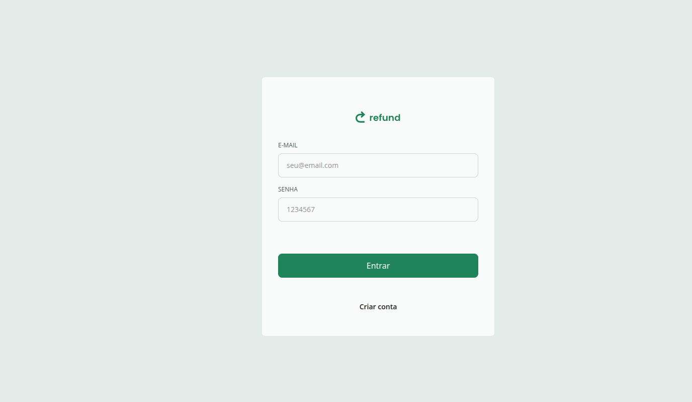
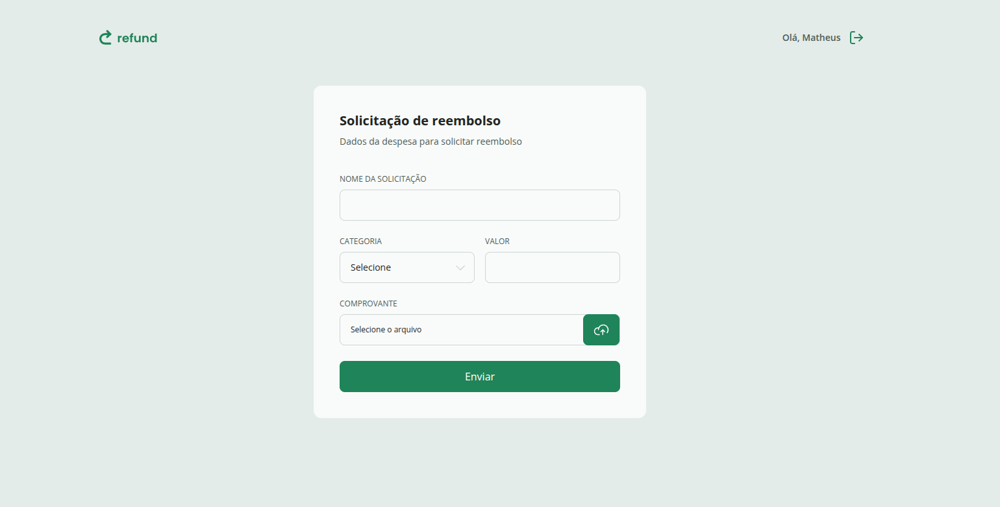
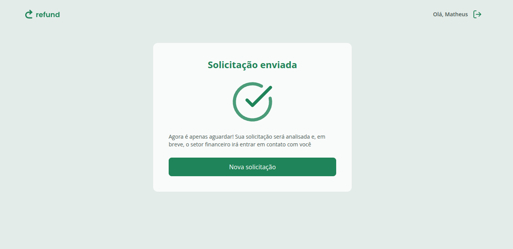
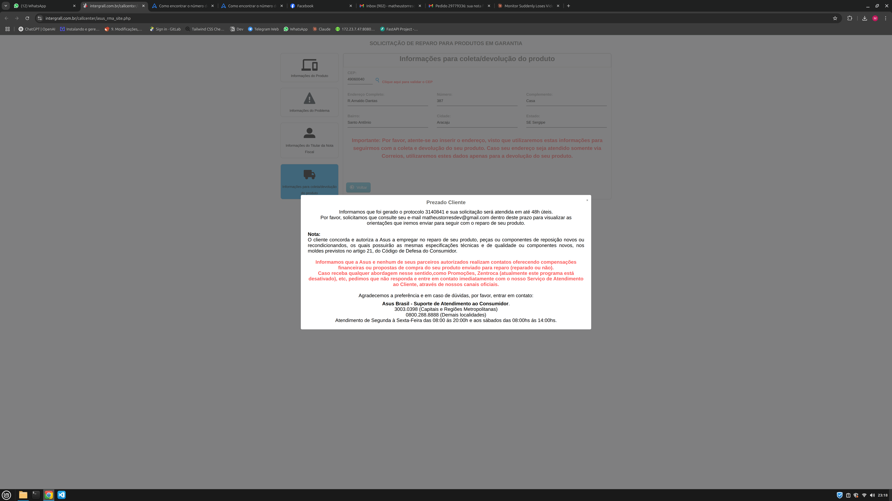

# 💸 Refund Web

Frontend do projeto **Refund**, versão web, desenvolvido na Parte 4 do curso Full-Stack da Rocketseat.  
Este frontend se conecta à **API Refund** da Parte 3 (Node.js + TypeScript) para gerenciar solicitações de reembolso, uploads de comprovantes e filtragem de registros.

---

## 📂 Funcionalidades

- Autenticação de usuários (Employee e Manager)
- Criação de solicitações de reembolso com upload de comprovantes
- Visualização de solicitações com filtros e paginação
- Área de confirmação de reembolsos (para Managers)
- Persistência de sessão usando LocalStorage
- Rotas protegidas por tipo de usuário
- Feedback visual para ações (alertas, loaders)

---

## 🖥️ Preview

<p align="center">
  <br>
  <br>
  <br>
   
</p>


---

## ⚡ Como Rodar o Projeto

> Este projeto frontend depende da API **API Refund** da Parte 3 do curso Full-Stack. Certifique-se de que o backend esteja rodando antes de iniciar o frontend.

### 1. Rodar o Frontend (Refund Web)

```bash
# Acesse a pasta do backend
cd refund

# Instale as dependências
npm install

# Rode o servidor
npm run dev
```

O frontend será servido, por padrão, em http://localhost:5173.
Certifique-se de que o baseURL do Axios no frontend aponte para a URL correta do backend (http://localhost:3333 ou a porta configurada).

## 🛠️ Tecnologias Utilizadas

- React + TypeScript
- React Router
- Axios
- Zod (validação de formulários)
- TailwindCSS + Tailwind Merge
- Vite


## 🔐 Estrutura de Rotas

AuthRoutes

/ → Login

/signup → Cadastro

EmployeeRoutes

/ → Lista de reembolsos

/confirm → Confirmar reembolso

ManagerRoutes

/ → Dashboard de reembolsos

/refund/:id → Detalhes de uma solicitação


## 📝 Observações

Antes de usar, garanta que a API Refund esteja funcionando corretamente.

Usuários devem ter permissão de employee ou manager para acessar as rotas protegidas.

Os uploads de comprovantes só aceitam arquivos válidos conforme configuração do backend.